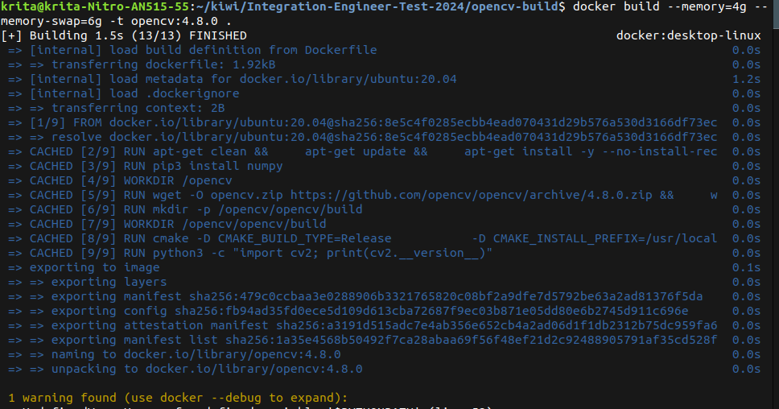

# **Project Documentation**

## **Overview**
This document outlines the steps taken to complete the project requirements, including solving issues, implementing features, debugging, and addressing the questionnaire. It includes references to the relevant files and directories.

---

## **Initial Setup**

### **1. Cloning the Repository**
- Cloned the repository and associated it with my GitHub account, ensuring the branch was private as per instructions.

### **2. Branch Creation**
- Created a `dev`, `master`, `main`, `staging` and `test` branch for the  general implementation.
- Each feature or fix was committed with a description following the provided format: `[FEAT]: description`.

---

## **Basic Points**

### **Docker Fix**
1. **Issue**: The Docker image was broken.
2. **Solution**:
   - Fixed issues in the [`Dockerfile`](/.devcontainer/Dockerfile).
   - Added:
     ```bash
      COPY ../rover /workspace/rover
      RUN echo "source /opt/ros/iron/setup.bash" >> /root/.bashrc
      RUN echo ". /workspace/rover/ros2/install/setup.bash" >> /root/.bashrc
     ```
     to `.bashrc` for automatic sourcing the ROS2 enviroment.

### **Debug and Diagnose**
- **Tools Used**: 
  - `rosboard` and `foxglove` were used for visualizing topics.
- **Steps**:
  1. Enabled the `NODE_ROSBOARD` in [`nodes_launch.sh`](rover/configs/nodes_launch.sh).
  2. Used the provided rosbag files to analyze topics such as `/imu/data` and `/camera/imu`.
  3. Answered diagnostic questions based on observations:
     - Real problem: I think that is the presence of false positives during the navigation, I know that on many cases the robots of Kiwibot are used to delivering, so exist an variable called like ODT (on delivery time) that can measure the effectiveness of the deliver method so to put it on context, when  on the general nav of the robot it detect an weird state like collision, bump, roll over or even a high G force on the movement stops, and in the cases of the less harming situations it must be just a warning or a system evaluation, so in order to solve this I put two identification models over the system.
     - Culprit: Possible the actual fail_detection with other node to handle this advices.
     - Next steps: Proposed fail-safe measures for navigation control.

<!-- ### **Fail Detection Node**
- Selected Python for implementation (C++ was an optional bonus).
- **Tasks**:
  1. Enabled the `NODE_FAIL_DETECTION_PY` in [`nodes_launch.sh`](rover/configs/nodes_launch.sh).
  2. Implemented collision and rollover detection using:
     - `/imu/data`
     - `/local_plan`
  3. Published accident detections to `/fail_detection/fail`.
  4. Tested using rosbag files, ensuring accurate detection.

--- -->

## **Extra Homework**

### **1. Autocompletion for `stack-build` Commands**
- Updated [`alias_script.sh`](../scripts/alias_script.sh) to add autocompletion support.
- The method used to achieve this was:
```
COMPREPLY=($(compgen -W "$options" -- "$cur"))
```
This with support of the packages name, following I obtained:
<center>
</center> 

### **2. OpenCV Dockerfile**
- Created a new `Dockerfile` to build OpenCV version 4.8.0 from scratch based on `ubuntu:20.04`. Where is located on [`Dockerfile_OpenCV`](../opencv-build/Dockerfile), was obtained the following machine:

<center>
</center>
Test of OpenCV presence:
<center>
</center>  

The command to build it is the follow:
```
docker build --memory=4g --memory-swap=6g -t opencv:4.8.0 .
```

### **3. Second Fail Detection Node**
- Implemented the fail detection node in C++ to complete both language versions.

### **4. DELETE_BUILD Argument**
- Modified the [`startRobotics.sh`](../scripts/startRobotics.sh) script:
  - Added the `DELETE_BUILD=0` variable.
  - Added the `--delete-build`/`-d` argument.
  - Enabled removal of `install`, `build`, and `log` folders. 
  


So I obtained the expected behavior:

<center>
</center>  

### **5. Unit Tests for Fail Detector**
- Wrote a unit test using `colcon test` to validate the fail detector node:
  - Played rosbag data to feed the node.
  - Verified collision and rollover detection accuracy.

---

## **Questionnaire**
[Solve](solutionQA.md)

---

## **References**
- [`Dockerfile`](../.devcontainer/Dockerfile): Fixes and OpenCV build.
- [`nodes_launch.sh`](rover/configs/nodes_launch.sh): Node configuration for testing and deployment.
- [`alias_script.sh`](scripts/alias_script.sh): Updated for autocompletion.
- [`startRobotics.sh`](scripts/startRobotics.sh): Added `DELETE_BUILD` argument.

---

## **Challenges and Solutions**
1. **Debugging Rosbags**:
   - Used `rosboard` to visualize and debug navigation issues.
2. **Fail Detection**:
   - Implemented two detectors with robust testing.
3. **C++ Node**:
   - Required additional learning to implement and debug.

---

## **Feedback**
- This project was challenging but well-structured with the requirements and the files that were requested.
- Instructions were clear, though debugging rosbag topics required significant effort and finally on my case is the time was painful due to my current work I had many responsibilities, so quit some "EXTRA" points I think that is value in order to evaluate the solution, with a shorter time but more accurate for the conditions of the majority. 
